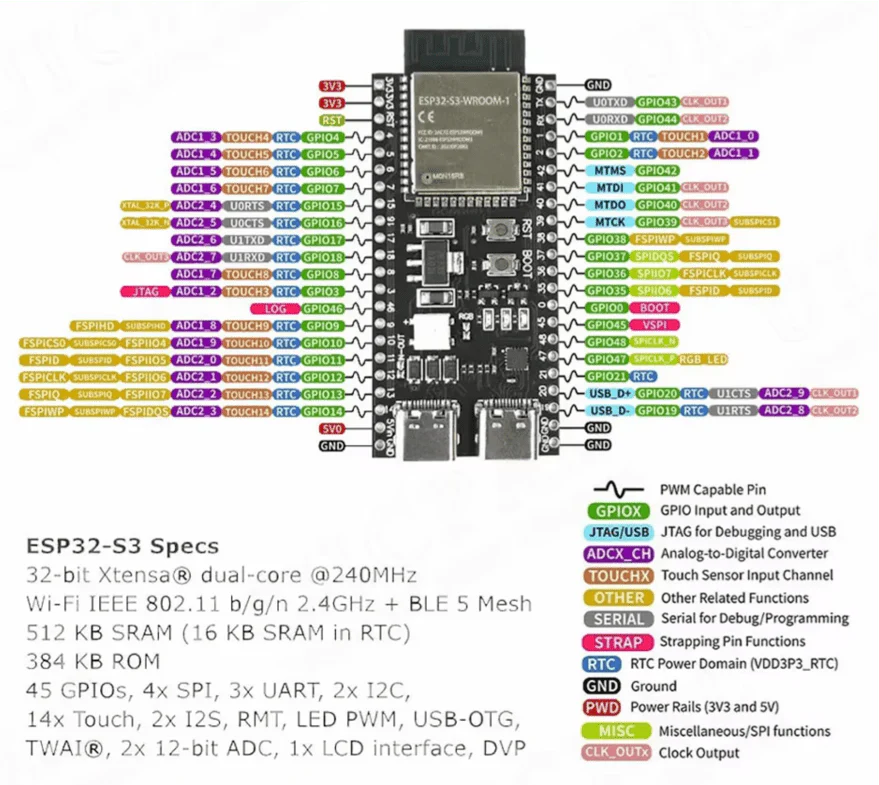

# Bibliotecas IOT

Este repositório contém bibliotecas e exemplos para projetos IoT utilizando ESP32-S3.

## ESP32-S3 Pin Definitions

## Estrutura do Projeto

- **bluetooth/** - Gerenciamento de comunicação Bluetooth
- **callmebot/** - Integração com serviço CallMeBot para notificações
- **HttpClient/** - Cliente HTTP para requisições web
- **influxDB/** - Integração com banco de dados InfluxDB
- **mqtt/** - Cliente MQTT para comunicação IoT
- **percepcao/** - Módulo de percepção e sensores

## Características do ESP32-S3

O ESP32-S3 é ideal para dispositivos IoT com:
- Baixo consumo de energia
- Wi-Fi + Bluetooth integrado
- Múltiplos pinos GPIO, PWM, ADC
- Suporte para aplicações de Smart Home, Automação Industrial, Healthcare, e mais

## Aplicações

- Smart Home
- Automação Industrial
- Eletrônicos de Consumo
- Smart Agriculture
- Máquinas POS
- Service Robot
- Audio Devices
- Sensores IoT de baixo consumo
- Data Loggers IoT
- Câmeras para streaming USB
- Reconhecimento de fala e imagem
- Touch e Proximity Sensing